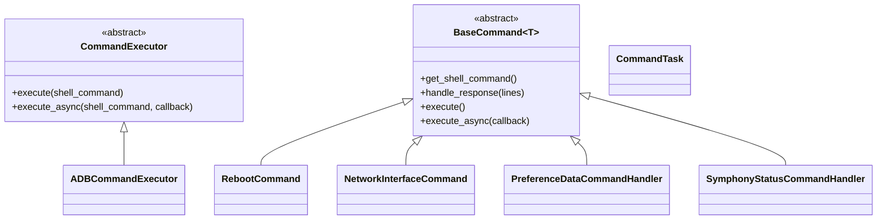
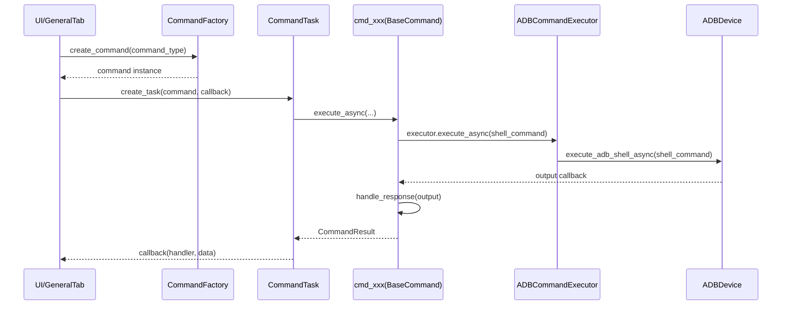

# QSUtils `command/` 디렉토리 전체 기능 Overview (KO)

이 문서는 `src/QSUtils/command/` 폴더의 구조와 각 파일군이 어떤 역할을 하는지 **큰 그림 중심**으로 정리한
가이드입니다.

---

## 1) 한 줄 요약

`command/`는 QSMonitor가 디바이스에 수행하는 작업(ADB shell, WAMP 호출, 상태 조회, 재부팅 등)을
**표준화된 Command 패턴**으로 실행하기 위한 실행 엔진입니다.

핵심은 아래 4단계로 이해하면 됩니다.

1. 명령 클래스(`cmd_*.py`, `BaseCommand`)가 쉘/WAMP 명령을 정의
2. 실행기(`command_executor.py`)가 실제 ADB shell 실행
3. 태스크(`CommandTask.py`)가 비동기/재시도/타임아웃 제어
4. 팩토리(`command_factory.py`)가 타입별 명령 생성/조립

---

## 2) 디렉토리 구성도 (개념)

```text
command/
├─ base_command.py              # 명령 공통 추상 베이스
├─ command_executor.py          # 실제 ADB shell 실행 추상/구현
├─ command_factory.py           # command_type -> 클래스 매핑, Task 생성
├─ CommandTask.py               # 비동기 실행, 타임아웃/재시도/시그널
├─ command_constants.py         # 공통 상수/Enum/CommandResult
├─ command_validator.py         # 명령/파라미터/연결 상태 검증
├─ retry_policy.py              # 재시도 정책
├─ timeout_manager.py           # 타임아웃 관리
├─ task_state_manager.py        # 태스크 상태 추적
├─ error_handler.py             # 예외/에러 결과 표준화
├─ process_manager.py           # 프로세스 제어 유틸
├─ log_file_manager.py          # 로그 파일 관리 유틸
├─ logging_signal_emitter.py    # 로깅 시그널 연결
├─ common.py                    # 공통 유틸
└─ cmd_*.py                     # 도메인 명령 구현체 (reboot, network, symphony ...)
```

---

## 3) 핵심 베이스 계층

## 3-1. `base_command.py`

모든 명령 구현체의 부모 클래스입니다.

- `get_shell_command()` : 실행할 쉘 명령 문자열 정의(하위 클래스 구현)
- `handle_response()` : 명령 결과 파싱 로직 정의(하위 클래스 구현)
- `execute()` / `execute_async()` : 동기/비동기 실행 공통 루틴 제공
- 내부에서 validator, retry_policy, executor를 조합해 안정적으로 실행

즉, **명령마다 다른 것은 "무슨 명령을 보낼지/결과를 어떻게 해석할지"**이고,
실행 절차는 BaseCommand가 통일합니다.

## 3-2. `command_executor.py`

실제 실행 계층입니다.

- `CommandExecutor`(추상): execute / execute_async 인터페이스
- `ADBCommandExecutor`(구현): `device.execute_adb_shell(...)` 호출

즉, QSMonitor 버튼/이벤트에서 시작된 명령도 최종적으로는 여기에서 ADB shell로 내려갑니다.

## 3-3. `command_constants.py`

공통 상수와 표준 결과 타입을 보유합니다.

- `SystemCommands` : `ifconfig`, `reboot`, `test-wamp-client` 템플릿
- `CommandResult[T]` : 성공/실패/데이터/에러를 일관된 형태로 캡슐화
- 각종 Enum/상수 (`ConnectionManagerActions`, `WampCommandType` 등)

---


## 3-4. 상속/호출 관계 조직도 (핵심 그림)

아래 다이어그램은 `command/`에서 자주 헷갈리는 **상속 관계(클래스 계층)**와
**실행 호출 관계(어떤 함수가 어떤 함수를 호출하는지)**를 함께 보여줍니다.

### A) 클래스 상속 관계 (Inheritance)



### B) 함수 호출 흐름 (Who calls who)

```mermaid
flowchart TD
    UI[QSMonitor Feature/Tab] --> F[CommandFactory.create_command]
    F --> C[cmd_xxx(BaseCommand 하위)]

    C --> E1[BaseCommand.execute]
    C --> E2[BaseCommand.execute_async]

    E1 --> V1[validator.validate_all]
    E1 --> X1[executor.execute]
    X1 --> A1[ADBCommandExecutor.execute]
    A1 --> D1[ADBDevice.execute_adb_shell]

    E2 --> V2[validator.validate_all]
    E2 --> X2[executor.execute_async]
    X2 --> A2[ADBCommandExecutor.execute_async]
    A2 --> D2[ADBDevice.execute_adb_shell_async]

    D1 --> H1[handle_response]
    D2 --> H2[handle_response]
    H1 --> R[CommandResult]
    H2 --> R
    R --> CB[UI callback / DeviceCommandExecutor]
```

### C) 실행 컨텍스트 포함 버전 (Task/Thread 관점)



발표 팁:
- **상속은 classDiagram(A)**, **실행은 flowchart/sequence(B,C)**로 나눠 보여주면 이해가 빠릅니다.
- 질문이 나오면 “BaseCommand가 실행 템플릿, cmd_xxx는 도메인 로직”이라는 문장으로 정리하면 좋습니다.

## 4) 실행 오케스트레이션 계층

## 4-1. `command_factory.py`

command_type 문자열을 실제 클래스에 매핑합니다.

예:
- `network_interface` → `NetworkInterfaceCommand`
- `reboot` → `RebootCommand`
- `symphony_status` → `SymphonyStatusCommandHandler`

또한 `CommandTask` 생성 유틸도 제공하므로, 상위 계층은 타입 기반으로 쉽게 명령을 조합할 수 있습니다.

## 4-2. `CommandTask.py`

비동기 태스크 실행 담당입니다.

- `QRunnable` 기반으로 스레드풀에서 실행
- 타임아웃 관리(`TimeoutManager`)
- 재시도 로직(`RetryPolicy`)
- 상태/진행/완료 시그널 제공

UI 입장에서는 "명령을 태스크로 던지고 콜백을 받는다"는 모델로 단순화됩니다.

---

## 5) 안정성/품질 보조 모듈

- `command_validator.py` : 파라미터/연결상태 등 사전 검증
- `retry_policy.py` : 고정/지수 백오프 재시도
- `timeout_manager.py` : 남은 시간/타임아웃 판정
- `task_state_manager.py` : running/cancelled/completed 관리
- `error_handler.py` : 예외를 `CommandResult.failure` 형태로 표준화
- `process_manager.py`, `log_file_manager.py`, `logging_signal_emitter.py`, `common.py` : 운영 유틸

즉, command 디렉토리는 단순 명령 집합이 아니라 **안정 실행 프레임워크**에 가깝습니다.

---

## 6) `cmd_*.py` 구현체 그룹별 의미

## 6-1. 장치/시스템 제어

- `cmd_reboot.py` : 재부팅
- `cmd_connection_manager.py` : 네트워크/연결 관련 액션
- `cmd_network_interface.py` : 인터페이스 정보 수집/파싱

## 6-2. 장치 정보/설정

- `cmd_get_device_info.py` : 디바이스 정보 조회
- `cmd_update_device_name.py`, `cmd_save_device_name.py` : 이름 갱신/저장
- `cmd_get_preference_data.py` : preference data 조회

## 6-3. Q-Symphony 도메인 명령

- `cmd_pp_symphony.py`
- `cmd_pp_symphony_group.py`
- `cmd_pp_symphony_volume_add.py`
- `cmd_pp_speaker_remap.py`
- `cmd_pp_surround_speaker_remap.py`

=> Q-Symphony 상태/그룹/볼륨/스피커 맵핑 관련 명령을 담당

## 6-4. 로그/덤프/진단 계열

- `cmd_logging.py`
- `cmd_coredump_monitor.py`

## 6-5. WAMP/확장 통신

- `cmd_test_wamp.py`
- `cmd_dsp_audio_setting.py`

---

## 7) QSMonitor에서 실제로 어떻게 쓰이나?

QSMonitor의 `GeneralTab`은 `DeviceCommandExecutor`를 생성하고, feature registry로부터 핸들러 목록을 받아
주기적으로 실행합니다. 즉 명령은 보통 **앱(UI)에서 간접 실행**됩니다.

흐름을 단순화하면:

1. GeneralTab/Feature가 필요 명령 타입 결정
2. Command 객체 생성(Factory)
3. DeviceCommandExecutor가 순차/주기 실행
4. CommandTask/콜백으로 결과를 UI 업데이트

---

## 8) 새 명령을 추가할 때의 실무 절차

1. `cmd_xxx.py` 생성 (`BaseCommand` 상속)
2. `get_shell_command()` / `handle_response()` 구현
3. 필요 시 validator/상수 추가
4. `command_factory.py`의 `_command_map` 또는 `_wamp_command_map`에 등록
5. 사용하는 Feature/탭에서 핸들러 목록에 포함

이 패턴을 따르면 확장 시에도 기존 아키텍처와 충돌 없이 기능을 넣을 수 있습니다.

---

## 9) 동료 공유용 핵심 메시지 (3문장)

1. `command/`는 ADB 기반 장치 제어를 위한 표준 Command 엔진이다.
2. 실행 안정성(재시도/타임아웃/검증/에러 표준화)을 프레임워크 차원에서 보장한다.
3. Q-Symphony 도메인 명령(`cmd_pp_*`)을 같은 실행 모델에 얹어 확장 가능하게 설계되어 있다.
