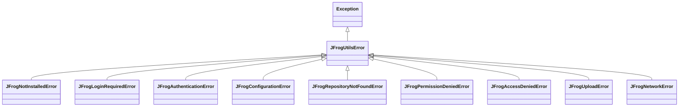
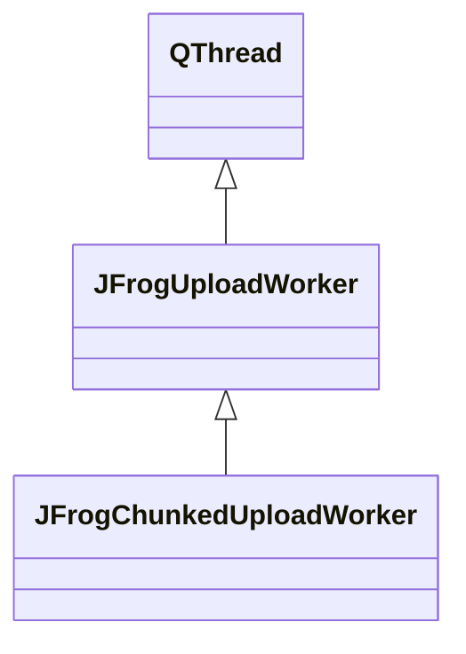
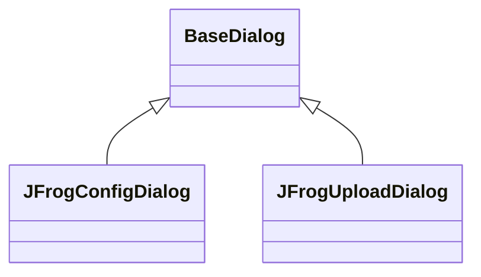
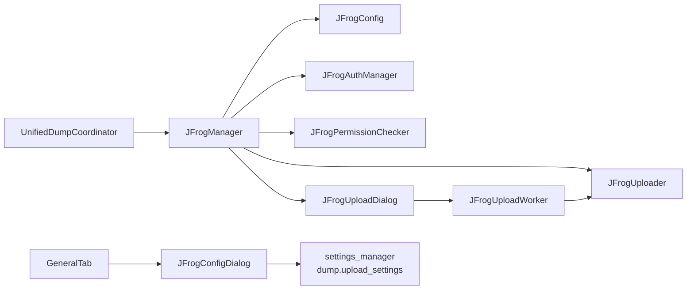
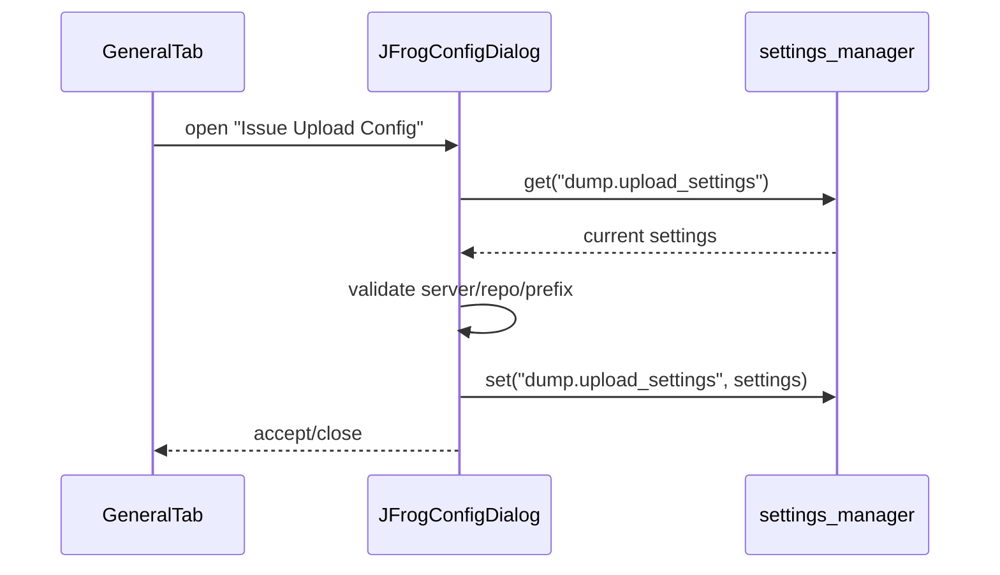
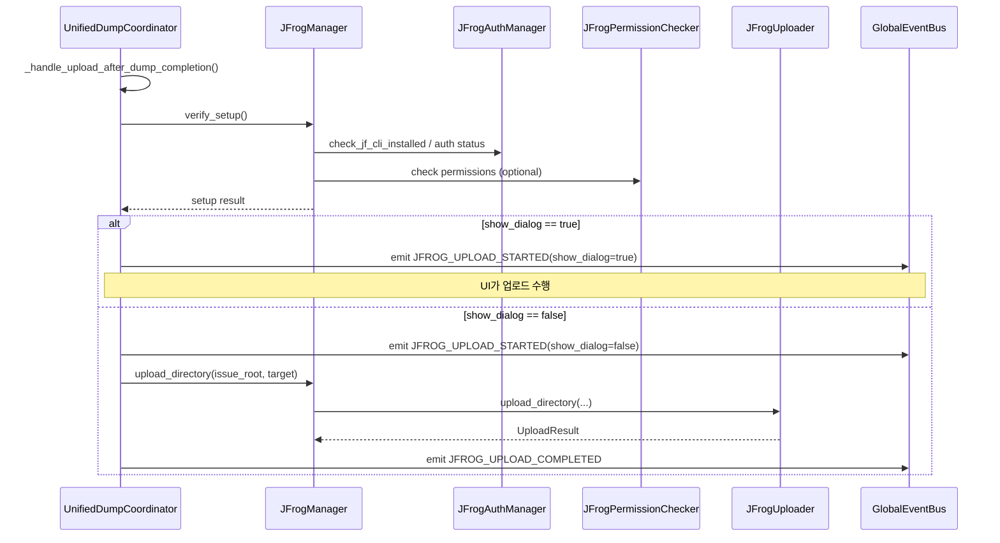
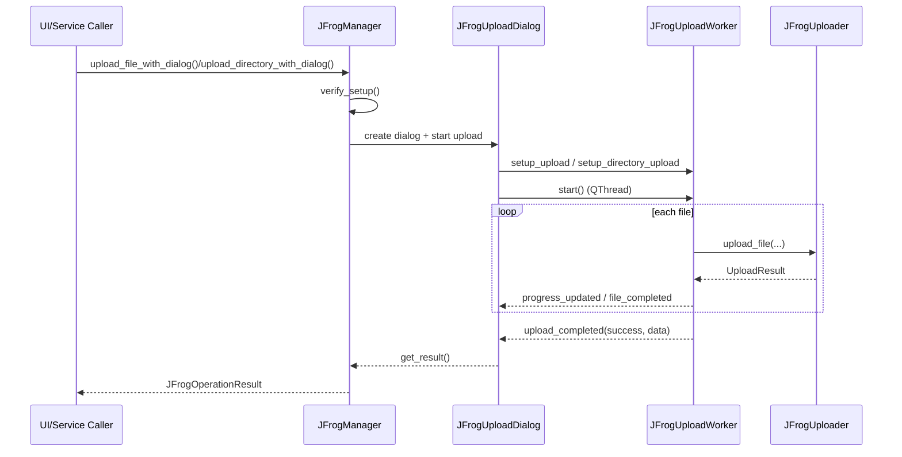

# QSUtils `JFrogUtils/` 아키텍처 & 실행 시퀀스 가이드 (KO)

이 문서는 `src/QSUtils/JFrogUtils` 폴더를 대상으로,

1. 레포지토리 전체에서 JFrogUtils가 담당하는 역할
2. 클래스 간 상속 관계
3. QSMonitor/Command 계층과의 연결 지점
4. 실제 실행 시퀀스(설정/업로드/이벤트)

를 한 번에 이해할 수 있도록 정리한 문서입니다.

---

## 1) JFrogUtils가 레포지토리에서 맡는 역할

`JFrogUtils`는 이 레포에서 **덤프/로그 산출물을 Artifactory(JFrog)로 업로드하는 전용 인프라 계층**입니다.

핵심 책임은 다음과 같습니다.

- **설정 관리**: 서버 URL/Repo/Prefix/타임아웃 등 업로드 설정 로드/검증
- **인증/권한 점검**: `jf` CLI 설치 여부, 로그인 상태, 저장소 접근/업로드 권한 확인
- **업로드 실행**: 파일/디렉토리 업로드, 실패/부분성공 처리, 결과 표준화
- **UI 연동**: 설정 다이얼로그/진행률 다이얼로그, 백그라운드 worker 시그널 처리
- **QSMonitor 오케스트레이션 연결**: UnifiedDumpCoordinator의 dump 이후 자동 업로드 경로 제공

즉, Command 폴더가 "디바이스 대상 명령 실행"을 담당한다면,
JFrogUtils는 "호스트 측 산출물의 저장소 배포"를 담당합니다.

---

## 2) 디렉터리 구성 요약

```text
JFrogUtils/
├─ JFrogConfig.py              # 업로드 설정(dataclass) + settings_manager 연동
├─ JFrogAuthManager.py         # jf-cli 설치/인증 상태 확인
├─ JFrogPermissionChecker.py   # repository read/upload 권한 확인
├─ JFrogUploader.py            # 실제 jf rt upload 수행(파일/디렉토리)
├─ JFrogUploadWorker.py        # QThread 기반 백그라운드 업로드
├─ JFrogUploadDialog.py        # 업로드 진행률/제어 UI
├─ JFrogConfigDialog.py        # 업로드 설정 UI
├─ JFrogManager.py             # 상위 파사드(verify_setup + upload orchestration)
├─ exceptions.py               # JFrog 전용 예외 계층
└─ __init__.py                 # 패키지 export
```

---

## 3) QSMonitor / Command 폴더와의 관계

## 3-1. QSMonitor와의 연결

- `UnifiedDumpCoordinator`가 `JFrogManager`를 초기화하고,
  dump 완료 후 업로드 여부를 결정한 뒤 업로드를 수행/트리거합니다.
- 업로드 진행은 전역 이벤트(`JFROG_UPLOAD_STARTED`, `JFROG_UPLOAD_COMPLETED`)로 브로드캐스트됩니다.
- `GeneralTab`에서는 `JFrogConfigDialog`를 열어 설정(`dump.upload_settings`)을 편집합니다.

즉, QSMonitor Service 계층의 "덤프 오케스트레이션" 다음 단계가 JFrogUtils입니다.

## 3-2. Command 폴더와의 관계

- Command 계층은 `BaseCommand` 기반으로 ADB/WAMP를 통해 **디바이스 내부 상태/명령**을 다룹니다.
- JFrogUtils는 `subprocess`로 `jf` CLI를 실행해 **호스트 파일 업로드**를 수행합니다.
- 따라서 두 계층은 목적과 실행 대상이 다르며, 직접 상속/실행 파이프라인을 공유하지 않습니다.

정리하면,
- Command = Device command execution pipeline
- JFrogUtils = Artifact upload pipeline

---

## 4) 클래스 상속 관계 (분리 다이어그램)

### A) 예외 계층



### B) Worker 계층



### C) Dialog 계층



> 나머지 주요 클래스(`JFrogManager`, `JFrogUploader`, `JFrogAuthManager`, `JFrogPermissionChecker`, `JFrogConfig`)는
> 상속보다 **합성(composition)** 중심 구조입니다.

---

## 5) 핵심 클래스 협력 구조 (합성 관점)



핵심 포인트:
- `JFrogManager`가 파사드 역할로 Auth/Permission/Uploader/Dialog를 오케스트레이션합니다.
- UI 모드에서는 `JFrogUploadDialog + JFrogUploadWorker`를 거치고,
- 헤드리스/자동 모드에서는 `JFrogManager -> JFrogUploader` 직접 경로를 탑니다.

---

## 6) 실행 시퀀스 #1 — 설정 변경 (GeneralTab → JFrogConfigDialog)



실무 의미:
- 이 경로에서 저장된 설정이 이후 `JFrogConfig.from_settings(...)` 및
  `UnifiedDumpCoordinator` 업로드 분기 판단에 재사용됩니다.

---

## 7) 실행 시퀀스 #2 — QSMonitor dump 완료 후 자동 업로드



실무 의미:
- 업로드 시작/완료를 이벤트로 분리해 DeviceWindow/MainWindow가 상태표시를 일관되게 처리합니다.

---

## 8) 실행 시퀀스 #3 — Dialog 기반 수동 업로드



실무 의미:
- 업로드 실행은 Worker 스레드에서 돌리고, UI는 시그널만 받아 반응하므로 UI freeze를 피합니다.

---

## 9) 파일별 전담 기능 요약

| 파일 | 전담 기능 |
|---|---|
| `JFrogConfig.py` | 설정 데이터 모델, `dump.upload_settings` 로드/검증, upload target 생성 |
| `JFrogAuthManager.py` | `jf --version`, `jf config show`, `jf rt ping` 기반 인증/설치 상태 점검 |
| `JFrogPermissionChecker.py` | 저장소 존재/읽기/업로드 권한 점검 (`jf rt curl`, 테스트 업로드) |
| `JFrogUploader.py` | `jf rt upload` 실행, 파일/디렉토리 업로드, 결과/진행률 모델 관리 |
| `JFrogUploadWorker.py` | QThread 기반 업로드 백그라운드 실행 + 진행 시그널 발행 |
| `JFrogUploadDialog.py` | 진행률/로그/중지/취소 UI 및 Worker 생명주기 관리 |
| `JFrogConfigDialog.py` | 서버/Repo/Prefix 설정 편집 및 저장 |
| `JFrogManager.py` | 상위 오케스트레이터(verify_setup, 권한 체크, dialog/직접 업로드 분기) |
| `exceptions.py` | JFrog 전용 도메인 예외 계층 |

---

## 10) 유지보수 체크포인트

1. **설정 키 일치성**: `dump.upload_settings` 키명(`jfrog_*`, prefix 등) 변경 시 ConfigDialog/Config/Coordinator 동시 점검
2. **CLI 의존성**: JFrogUtils는 `jf` 실행환경에 의존하므로 배포/CI 환경에서 PATH/로그인 상태 확인 필수
3. **UI/헤드리스 분기**: `show_dialog` 분기 로직(수동/자동 트리거) 변경 시 이벤트 흐름 검증 필요
4. **권한 점검 비용**: verify_setup의 permission check가 빈번하면 지연이 커질 수 있어 호출 시점 최적화 필요
5. **이벤트 계약 유지**: `JFROG_UPLOAD_STARTED/COMPLETED` payload 필드 변경 시 구독자(DeviceWindow 등) 동시 수정

---

## 11) 한 줄 요약

`JFrogUtils`는 QSMonitor의 덤프 결과물을 Artifactory로 안전하게 올리기 위한 **설정·인증·권한·업로드·UI 진행률** 통합 계층이며,
`UnifiedDumpCoordinator`와 전역 이벤트 버스를 통해 자동/수동 업로드 흐름을 완성합니다.
