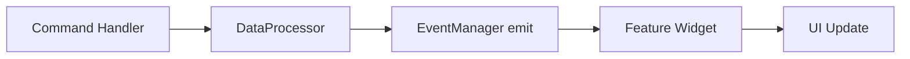
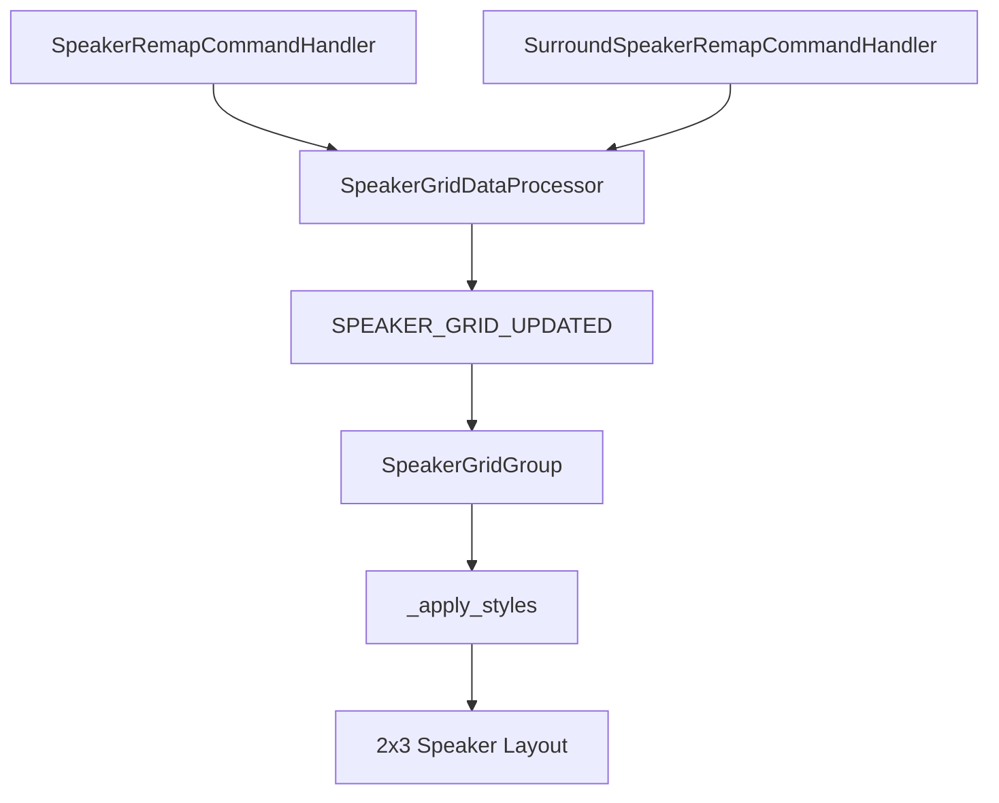

# QSMonitor Feature 비교 가이드 (Default / Network / SpeakerGrid)

요청하신 대로 `DefaultMonitorFeature`, `NetworkMonitorFeature`, `SpeakerGridFeature`를
같은 관점(입력 커맨드 → DataProcessor → 이벤트 → UI)에 맞춰 나란히 비교한 문서입니다.

---

## 1) 한눈에 보는 차이

| Feature | 무엇을 보여주나 | 핵심 커맨드(예시) | UI 성격 |
|---|---|---|---|
| DefaultMonitorFeature | Q-Symphony 기본 상태/핵심 상태값 | `SymphonyStatus`, `SymphonyGroup`, `SymphonyVolumeAdd` | 텍스트/상태값 중심 |
| NetworkMonitorFeature | 네트워크 인터페이스/연결 정보 | `NetworkInterfaceCommand` | 네트워크 상태 표시 |
| SpeakerGridFeature | 스피커 위치/서라운드 활성 맵 | `SpeakerRemap`, `SurroundSpeakerRemap` | 2x3 그리드 시각화 |

핵심: SpeakerGrid는 "연결됨/안됨"보다 **위치/맵핑 시각화**가 목적입니다.

---

## 2) 공통 아키텍처 패턴

세 Feature 모두 `BaseFeature`를 상속하고, 내부적으로 같은 패턴을 따릅니다.

1. Feature가 필요한 커맨드 핸들러 목록을 선언
2. DataProcessor가 커맨드 결과를 해석
3. EventManager로 이벤트 발행
4. Widget이 이벤트를 받아 화면 갱신

---

## 3) DefaultMonitorFeature 체인

- Feature 클래스: `DefaultMonitorFeature`
- DataProcessor: `DefaultMonitorDataProcessor`
- Widget: `DefaultMonitorGroup`
- 주로 Q-Symphony의 핵심 상태를 읽고 텍스트 기반 상태로 반영

운영 관점:
- "지금 QS가 켜져 있는지", "그룹/볼륨 관련 상태가 어떤지" 같은 기본 상태 체크에 강함.

---

## 4) NetworkMonitorFeature 체인

- Feature 클래스: `NetworkMonitorFeature`
- DataProcessor: `NetworkMonitorDataProcessor`
- Widget: `NetworkMonitorGroup`
- 네트워크 인터페이스 커맨드 결과를 파싱해 연결 상태/주소 정보를 표시

운영 관점:
- 장치 자체 문제인지, 네트워크 조건 문제인지 빠르게 분리해서 보는 데 유리.

---

## 5) SpeakerGridFeature 체인 (상세)

- Feature 클래스: `SpeakerGridFeature`
- DataProcessor: `SpeakerGridDataProcessor`
- Widget: `SpeakerGridGroup`
- 필수 커맨드:
  - `SpeakerRemapCommandHandler`
  - `SurroundSpeakerRemapCommandHandler`

### 동작 방식

1. `SpeakerRemapCommandHandler` 결과(int)를 받아 `position_id`로 저장
2. `SurroundSpeakerRemapCommandHandler` 결과(list)에서 활성 surround ID 목록 추출
3. DataProcessor가 `SPEAKER_GRID_UPDATED` 이벤트 발행
4. Widget이 이벤트 타입별(`speaker_remap` / `surround_speaker`)로 상태 갱신
5. `_apply_styles()`에서 셀 색상/텍스트를 변경

### 시각화 규칙

- 파란색 + `THIS`: 현재 기준 위치
- 초록색 + `SPK`: 활성 서라운드 스피커
- 시안색 + `THIS`: 둘 다 해당되는 셀
- 흰색: 기본 상태

---

## 6) 왜 SpeakerGrid가 따로 중요한가?

Default/Network는 "상태값 확인" 성격이 강하지만,
SpeakerGrid는 **공간/배치 관점에서 현재 오디오 매핑 상태를 시각적으로 확인**할 수 있다는 점이 핵심입니다.

즉 테스트/디버깅 시:
- "값이 맞는가"(Default/Network) +
- "실제 스피커 배치 맥락에서 맞는가"(SpeakerGrid)
를 함께 볼 수 있습니다.

---

## 7) 팀 공유용 짧은 멘트

- DefaultMonitorFeature: "기본 상태 계기판"
- NetworkMonitorFeature: "연결/인터페이스 상태 계기판"
- SpeakerGridFeature: "스피커 배치 맵 시각화"

이렇게 기억하면 세 Feature의 역할 분리가 가장 직관적입니다.
