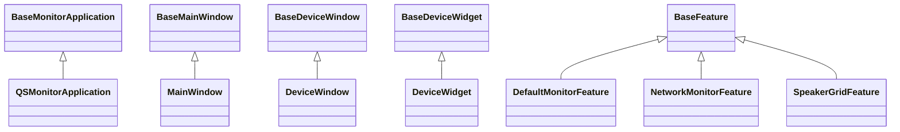
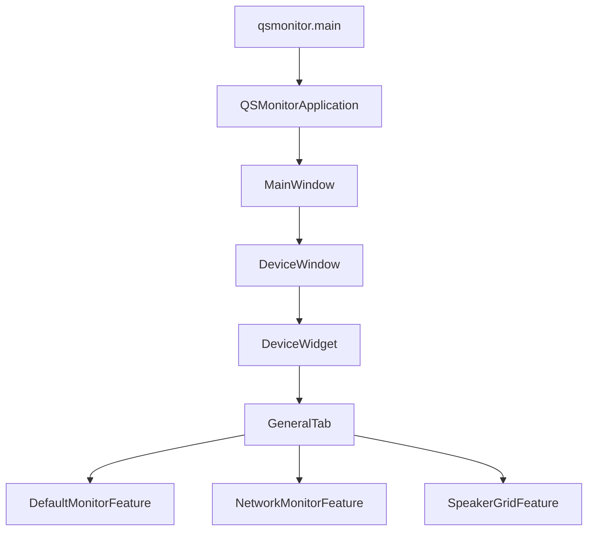

# QSMonitor 상속 구조 요약 (KO)

이 문서는 `QSMonitor`와 직접 연관된 클래스/함수의 **상속 관계**를 빠르게 이해하기 위한 요약 자료입니다.

---

## 1) 핵심 요약

QSMonitor는 `UIFramework`의 공통 베이스 클래스를 상속해 구성됩니다.

- 앱 실행 계층: `BaseMonitorApplication` → `QSMonitorApplication`
- 메인 윈도우 계층: `BaseMainWindow` → `MainWindow`
- 디바이스 윈도우 계층: `BaseDeviceWindow` → `DeviceWindow`
- 디바이스 위젯 계층: `BaseDeviceWidget` → `DeviceWidget`
- 기능(Feature) 계층: `BaseFeature` → (`Default/Network/SpeakerGrid` Feature)

즉, 공통 동작은 Base에 두고, QSMonitor 쪽은 필요한 확장만 덧붙이는 구조입니다.

---

## 2) 클래스 상속 다이어그램

---

## 3) 실행 흐름 다이어그램 (상속 관점)

포인트:
- 상위(Base) 클래스는 공통 lifecycle/UI/이벤트 연결을 제공
- 하위(QSMonitor) 클래스는 탭/상태바/서비스(예: CrashMonitor) 같은 앱 특화 기능을 담당

---

## 4) 파일 기준 상속 맵

### 4-1. 앱/윈도우
- `src/QSUtils/QSMonitor/QSMonitorApplication.py`
  - `QSMonitorApplication(BaseMonitorApplication)`
- `src/QSUtils/QSMonitor/ui/MainWindow.py`
  - `MainWindow(BaseMainWindow)`
- `src/QSUtils/QSMonitor/ui/DeviceWindow.py`
  - `DeviceWindow(BaseDeviceWindow)`
- `src/QSUtils/QSMonitor/ui/DeviceWidget.py`
  - `DeviceWidget(BaseDeviceWidget)`

### 4-2. Feature
- `src/QSUtils/QSMonitor/features/base/BaseFeature.py`
  - Feature 공통 추상 베이스
- `src/QSUtils/QSMonitor/features/DefaultMonitor/DefaultMonitorFeature.py`
- `src/QSUtils/QSMonitor/features/NetworkMonitor/NetworkMonitorFeature.py`
- `src/QSUtils/QSMonitor/features/SpeakerGrid/SpeakerGridFeature.py`
  - 위 3개는 `BaseFeature` 상속

---

## 5) 함수/메서드 관점에서 보면

### A. 앱 초기화 체인
1. `qsmonitor.py`의 `main()`
2. `AppLauncher.launch_app(QSMonitorApplication, app_config)`
3. `QSMonitorApplication.__init__()`에서 `MainWindow` 주입

### B. 디바이스 UI 체인
1. `MainWindow`가 디바이스 윈도우 클래스로 `DeviceWindow` 사용
2. `DeviceWindow`가 내부 탭 위젯 클래스로 `DeviceWidget` 사용
3. `DeviceWidget`이 `GeneralTab`과 `AutoRebootTab` 구성
4. `GeneralTab`에서 Feature 인스턴스 생성/등록

이 흐름이 “Base 공통 + QSMonitor 확장” 설계를 실제 런타임에서 구현합니다.

---

## 6) 발표/공유 시 한 줄 설명 템플릿

- **“QSMonitor는 UIFramework Base를 상속해 공통 기능을 재사용하고, DeviceWidget/Feature 계층에서 모니터링 로직을 확장하는 구조입니다.”**
- **“클래스 상속은 단순하지만, 이벤트와 서비스(CrashMonitor, DumpCoordinator)가 결합되어 실제 동작이 완성됩니다.”**

