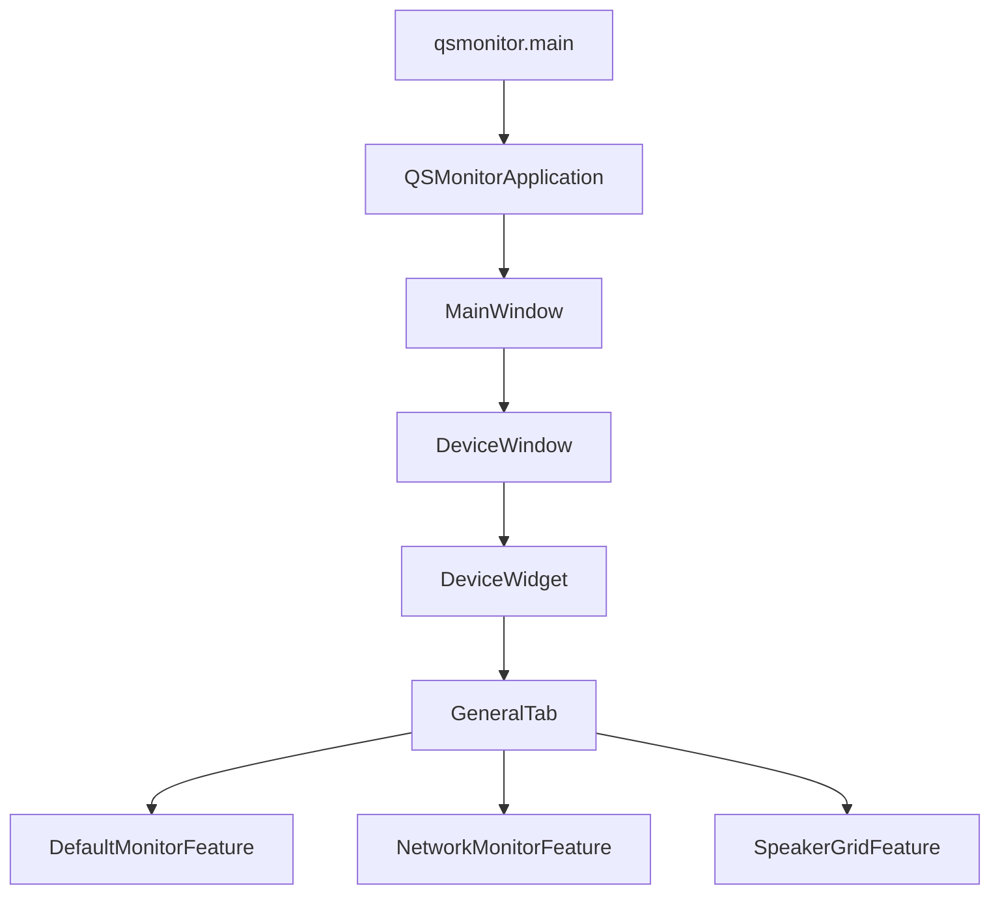

# QSMonitor 상속 구조 요약 (KO)

이 문서는 `QSMonitor`와 직접 연관된 클래스/함수의 **상속 관계**를 빠르게 이해하기 위한 요약 자료입니다.

---

## 1) 핵심 요약

QSMonitor는 `UIFramework`의 공통 베이스 클래스를 상속해 구성됩니다.

- 앱 실행 계층: `BaseMonitorApplication` → `QSMonitorApplication`
- 메인 윈도우 계층: `BaseMainWindow` → `MainWindow`
- 디바이스 윈도우 계층: `BaseDeviceWindow` → `DeviceWindow`
- 디바이스 위젯 계층: `BaseDeviceWidget` → `DeviceWidget`
- 기능(Feature) 계층: `BaseFeature` → (`Default/Network/SpeakerGrid` Feature)

즉, 공통 동작은 Base에 두고, QSMonitor 쪽은 필요한 확장만 덧붙이는 구조입니다.

---

## 2) 클래스 상속 다이어그램

---

## 3) 실행 흐름 다이어그램 (상속 관점)

포인트:
- 상위(Base) 클래스는 공통 lifecycle/UI/이벤트 연결을 제공
- 하위(QSMonitor) 클래스는 탭/상태바/서비스(예: CrashMonitor) 같은 앱 특화 기능을 담당

---

## 4) 파일 기준 상속 맵

### 4-1. 앱/윈도우
- `src/QSUtils/QSMonitor/QSMonitorApplication.py`
  - `QSMonitorApplication(BaseMonitorApplication)`
- `src/QSUtils/QSMonitor/ui/MainWindow.py`
  - `MainWindow(BaseMainWindow)`
- `src/QSUtils/QSMonitor/ui/DeviceWindow.py`
  - `DeviceWindow(BaseDeviceWindow)`
- `src/QSUtils/QSMonitor/ui/DeviceWidget.py`
  - `DeviceWidget(BaseDeviceWidget)`

### 4-2. Feature
- `src/QSUtils/QSMonitor/features/base/BaseFeature.py`
  - Feature 공통 추상 베이스
- `src/QSUtils/QSMonitor/features/DefaultMonitor/DefaultMonitorFeature.py`
- `src/QSUtils/QSMonitor/features/NetworkMonitor/NetworkMonitorFeature.py`
- `src/QSUtils/QSMonitor/features/SpeakerGrid/SpeakerGridFeature.py`
  - 위 3개는 `BaseFeature` 상속

---

## 5) Base ↔ QSMonitor 메서드 상세 비교

아래는 **상위 클래스(Base)**에 있는 공통 메서드와 **하위 클래스(QSMonitor)**에서 확장/오버라이드하는 메서드를
짝으로 정리한 표입니다.

## 5-1. Application 계층

| 계층 | Base 메서드/역할 | QSMonitor 메서드/역할 | 관계 |
|---|---|---|---|
| App | `BaseMonitorApplication`이 공통 앱 lifecycle 관리 | `QSMonitorApplication.__init__`에서 `MainWindow`를 주입 | 하위가 “어떤 메인 윈도우를 쓸지” 결정 |

핵심: Application 계층은 오버라이드가 많지 않고 **조립(Composition) 지정**이 주 역할입니다.

## 5-2. MainWindow 계층

| 계층 | Base 메서드/역할 | QSMonitor 메서드/역할 | 관계 |
|---|---|---|---|
| Main Window | `BaseMainWindow.__init__`에서 공통 UI/디바이스 목록/전역 버스/코디네이터 초기화 | `MainWindow.__init__`에서 `device_window_cls=DeviceWindow` 지정 | 하위가 디바이스 창 타입을 주입 |
| Main Window | Base가 공통 버튼/로그레벨/업로드 설정/핸들러 관리 | QSMonitor는 `app_config.setup_specific_features()` 호출 | 하위가 앱별 세부 기능 훅 연결 |

핵심: MainWindow는 Base가 “플랫폼”이고, QSMonitor는 “설정 바인딩”에 집중합니다.

## 5-3. DeviceWindow 계층

| 계층 | Base 메서드/역할 | QSMonitor 메서드/역할 | 관계 |
|---|---|---|---|
| Device Window | `_setup_status_bar`, `_on_connection_changed`, `_on_session_state_changed`, `_on_dump_*` 등 공통 상태바 처리 | `_add_custom_status_widgets`에서 AutoReboot 라벨/업로드 이벤트 추가 | Base 훅 구현으로 기능 확장 |
| Device Window | `_update_left_status_layout` 기본 우선순위 처리 | `DeviceWindow._update_left_status_layout`에서 `Dump > AutoReboot` 우선순위로 재정의 | 오버라이드로 표시 정책 커스터마이징 |
| Device Window | `closeEvent`에서 기본 정리 | `DeviceWindow.closeEvent`에서 등록한 핸들러 해제 추가 후 `super()` 호출 | 자식이 추가 리소스 정리 책임 |

핵심: DeviceWindow는 Base의 상태바 엔진 위에 **앱 특화 상태(autoreboot/upload)**를 얹는 구조입니다.

## 5-4. DeviceWidget 계층

| 계층 | Base 메서드/역할 | QSMonitor 메서드/역할 | 관계 |
|---|---|---|---|
| Device Widget | `_setup_basic_ui`, `_setup_event_handlers`, `start_session`, `stop_session`, `_start_user_session`, `_stop_user_session` 등 공통 세션/디바이스 제어 | `_create_tab_interface`로 `GeneralTab/AutoRebootTab` 생성 | Base 골격 + 하위 탭 구성 |
| Device Widget | `_on_session_started`, `_on_session_stopped` 기본 훅 | QSMonitor에서 CrashMonitorService 시작/중지 로직으로 오버라이드 | 세션 lifecycle 확장 |
| Device Widget | `_setup_app_specific_ui`는 하위 구현 포인트 | QSMonitor는 Base 기본 UI와 충돌 없도록 `pass`로 처리 후 별도 탭 추가 | 훅 사용 패턴 |
| Device Widget | 연결/해제 기본 처리 | `on_device_connected/disconnected`에서 세션 시작/정지 정책 추가 | 디바이스 이벤트 정책 확장 |

핵심: DeviceWidget은 상속 체인 중 가장 실무 로직이 많은 계층이며, **세션-명령-크래시 감시 결합 지점**입니다.

## 5-5. Feature 계층

| 계층 | Base 메서드/역할 | QSMonitor 메서드/역할 | 관계 |
|---|---|---|---|
| Feature | `BaseFeature.__init__`에서 DataProcessor 공유/Widget 생성/이벤트 등록/CommandHandler 등록 자동화 | 각 Feature가 `_create_data_processor`, `_create_widget`, `get_required_command_handlers` 구현 | 추상 메서드 구현으로 기능 주입 |
| Feature | 공통 `process_command_result`, `apply_session_state`, `get_current_states` 제공 | 하위 Feature는 도메인별 처리기/위젯만 교체 | 템플릿 메서드 패턴 |

핵심: Feature는 “공통 템플릿 + 도메인 플러그인” 구조라 신규 기능 추가가 쉽습니다.

---

## 6) Base ↔ Child 관계를 코드 관점으로 해석하기

## 6-1. 템플릿 메서드 패턴
- Base가 실행 순서를 고정하고,
- Child는 특정 훅만 채웁니다.

예시:
- `BaseFeature.__init__`는 전체 초기화 절차를 수행
- Child Feature는 `_create_data_processor`, `_create_widget`만 구현

## 6-2. 훅(Hook) 기반 확장
- `BaseDeviceWindow._add_custom_status_widgets()` 같은 메서드는 빈 훅
- `DeviceWindow`가 해당 훅을 구현해 기능을 넣음

## 6-3. `super()` 체인으로 공통 + 특화 결합
- Child에서 오버라이드 시 Base 동작을 유지하려면 `super()` 호출
- `DeviceWindow.closeEvent`, `DeviceWidget._setup_event_handlers`가 대표 사례

---

## 7) 발표/온보딩용 설명 템플릿

- **한 문장 요약**:
  - “QSMonitor는 UIFramework Base가 제공하는 공통 lifecycle 위에, DeviceWindow/DeviceWidget/Feature에서
    앱 특화 로직을 얹는 상속 구조입니다.”

- **관계 설명 3단계**:
  1. Base가 공통 골격(세션/이벤트/UI 프레임)을 담당
  2. Child가 훅/오버라이드로 QSMonitor 기능(탭, AutoReboot, Crash 감시)을 추가
  3. Feature가 플러그인처럼 붙어 명령과 UI를 도메인별로 분리

---

## 8) 함수/메서드 관점 런타임 체인

### A. 앱 초기화 체인
1. `qsmonitor.py`의 `main()`
2. `AppLauncher.launch_app(QSMonitorApplication, app_config)`
3. `QSMonitorApplication.__init__()`에서 `MainWindow` 주입

### B. 디바이스 UI 체인
1. `MainWindow`가 디바이스 윈도우 클래스로 `DeviceWindow` 사용
2. `DeviceWindow`가 내부 탭 위젯 클래스로 `DeviceWidget` 사용
3. `DeviceWidget`이 `GeneralTab`과 `AutoRebootTab` 구성
4. `GeneralTab`에서 Feature 인스턴스 생성/등록

이 흐름이 “Base 공통 + QSMonitor 확장” 설계를 실제 런타임에서 구현합니다.

