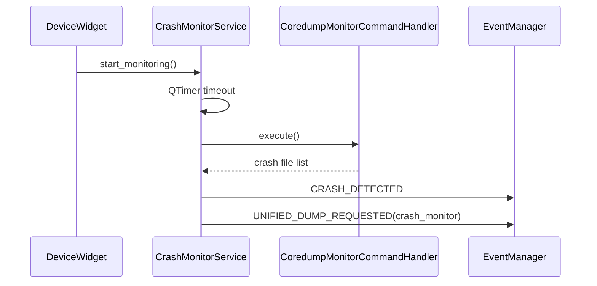
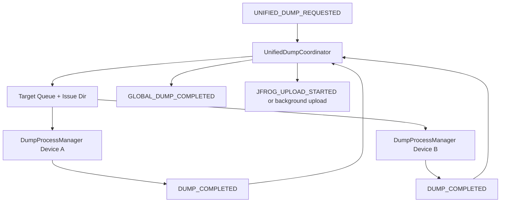

# QSMonitor Service 가이드 (KO)

이 문서는 QSMonitor의 `services/` 계층을 Feature 문서와 같은 관점으로 정리한 가이드입니다.

---

## 1) Service 계층의 목적

Feature가 “상태를 보여주는 UI 중심 계층”이라면, Service는 “백그라운드에서 자동으로 동작하는 운영 계층”입니다.

- Feature: Command 결과를 UI에 표시
- Service: 타이머/이벤트/오케스트레이션으로 감시·덤프·업로드 자동화

즉, Service는 **자동 대응 파이프라인**을 담당합니다.

---

## 2) 현재 QSMonitor services 구성

`src/QSUtils/QSMonitor/services/` 기준:

- `CrashMonitorService.py` : 디바이스 단위 코어덤프 감시 서비스
- `UnifiedDumpCoordinator.py` : 앱 전역 통합 덤프/업로드 코디네이터
- `GlobalDumpCoordinator.py` : deprecated 호환용 래퍼(실사용 X)

---

## 3) Feature와 Service의 관계

```mermaid
flowchart LR
    F[Feature Layer\nDefault/Network/SpeakerGrid] --> E[EventManager/EventBus]
    S1[CrashMonitorService\n(Per Device)] --> E
    S2[UnifiedDumpCoordinator\n(Global)] --> E
    E --> UI[DeviceWindow/MainWindow UI]
```

핵심:
- **Feature와 Service는 직접 강결합하지 않고 이벤트로 연결**됩니다.
- 덕분에 UI 변경 없이 자동 대응 로직(Service)을 확장하기 쉽습니다.

---

## 4) CrashMonitorService 상세

### 4-1. 역할

`CrashMonitorService`는 디바이스 로컬(탭 단위) 서비스로,
코어덤프(crash 파일) 감시를 주기적으로 수행합니다.

### 4-2. 동작 흐름

1. `DeviceWidget`에서 서비스 생성 및 등록
2. 세션 시작 시 `start_monitoring()`
3. `QTimer` 주기로 `_check_and_handle_crash_files()` 실행
4. `CoredumpMonitorCommandHandler` 결과에서 crash 파일 탐지
5. 탐지 시 `CRASH_DETECTED` 이벤트 발행
6. 이어서 `UNIFIED_DUMP_REQUESTED(triggered_by=crash_monitor)` 이벤트 발행



### 4-3. 안정성 포인트

- dump 진행 중(`is_dump_in_progress`)에는 감시 스킵해 중복 트리거를 방지
- `DUMP_STARTED/COMPLETED/ERROR` 이벤트를 수신해 내부 플래그를 관리

---

## 5) UnifiedDumpCoordinator 상세

### 5-1. 역할

`UnifiedDumpCoordinator`는 앱 전역 서비스로,
다수 디바이스의 덤프 요청을 하나의 Issue 단위로 묶고, 완료 후 업로드까지 조정합니다.

### 5-2. 핵심 책임

- 통합 덤프 요청 이벤트 수신 (`UNIFIED_DUMP_REQUESTED`)
- 대상 디바이스 수집 및 큐 관리
- 동시성 제어 (`_max_concurrency`)
- 경로 전략 적용 (unified / individual / hybrid)
- `manifest.json` 관리
- JFrog 업로드 수행 또는 UI 업로드 요청 이벤트 발행

### 5-3. 덤프~업로드 흐름



### 5-4. 업로드 모드 분기

- 수동 덤프/설정 활성 시: UI 다이얼로그 업로드 요청
- 자동화/헤드리스 시: 백그라운드 업로드 실행

즉, 트리거 타입과 설정에 따라 UX를 분기하면서도, 결과는 일관되게 manifest로 정리합니다.

---

## 6) GlobalDumpCoordinator (Deprecated)

`GlobalDumpCoordinator`는 현재 deprecated이며,
모든 기능은 `UnifiedDumpCoordinator`로 이관되었습니다.

실무적으로는 새 코드/설명에서 `UnifiedDumpCoordinator`만 기준으로 보면 됩니다.

---

## 7) DeviceWidget/MainWindow와의 연결 지점

## 7-1. DeviceWidget ↔ CrashMonitorService
- DeviceWidget 생성 시 `CrashMonitorService` 생성
- 세션 start/stop 훅에서 monitoring start/stop 호출

## 7-2. BaseMainWindow ↔ UnifiedDumpCoordinator
- MainWindow 초기화 시 전역 버스와 함께 코디네이터 생성/시작
- `JFROG_UPLOAD_STARTED/COMPLETED` 이벤트 핸들러 등록

즉,
- 디바이스 로컬 자동 감시는 DeviceWidget 경로,
- 전역 덤프 집계/업로드는 MainWindow 경로로 붙습니다.

---

## 8) Feature 가이드와 함께 볼 때의 이해 포인트

Feature 가이드와 Service 가이드를 함께 보면 다음처럼 역할이 나뉩니다.

- Feature: “현재 상태를 어떻게 보여줄까?”
- Service: “이상 상황을 어떻게 자동 처리할까?”

이 분리가 QSMonitor 확장의 핵심입니다.

---

## 9) 팀 공유용 요약 멘트

1. CrashMonitorService는 디바이스 단위 감시 서비스다.
2. UnifiedDumpCoordinator는 전역 덤프/업로드 오케스트레이터다.
3. Feature와 Service는 이벤트로 연결되어, UI와 운영 자동화가 느슨하게 결합된다.
