# QSUtils `src/QSUtils/command` 상세 가이드 (KO)

이 문서는 `src/QSUtils/command` 폴더의 **전체 Python 파일(.py)**을 대상으로,

1. 상속 구조(클래스 계층)
2. 실행/오케스트레이션 다이어그램
3. 파일별 전담 기능(무엇을 책임지는지)

를 한 번에 파악할 수 있도록 정리한 문서입니다.

---

## 1) 디렉터리 전체 구조 요약

`command` 폴더는 크게 4계층으로 볼 수 있습니다.

- **코어 추상화 계층**: `base_command.py`, `command_executor.py`, `command_validator.py`, `common.py`, `command_constants.py`
- **도메인 명령어 계층**: `cmd_*.py` (네트워크, DSP, 로그, 디바이스 정보, 재부팅 등)
- **실행 런타임 계층**: `CommandTask.py`, `task_state_manager.py`, `retry_policy.py`, `timeout_manager.py`, `process_manager.py`, `logging_signal_emitter.py`, `log_file_manager.py`
- **조립/에러 처리 계층**: `command_factory.py`, `error_handler.py`

---

## 2) 아키텍처 다이어그램 (실행 관점)

```mermaid
flowchart TD
    Caller[UI/Feature/Service Caller] --> Factory[CommandFactory]
    Factory --> Cmd[Concrete Command 객체]

    Cmd --> Base[BaseCommand.execute]
    Base --> Validator[CommandValidator / BaseCommandValidator]
    Base --> Executor[ADBCommandExecutor]
    Executor --> Device[ADBDevice.shell]

    Cmd -->|비동기| Task[CommandTask]
    Task --> State[TaskStateManager]
    Task --> Retry[RetryPolicy]
    Task --> Timeout[TimeoutManager]

    LogCmd[LoggingCommand] --> PM[ProcessManager]
    PM --> QProc[QProcess]
    LogCmd --> LSM[LoggingSignalEmitter]
    LogCmd --> LFM[LogFileManager]

    Base --> Err[CommandErrorHandler]
    Base --> Result[CommandResult[T]]
```

핵심은 **Factory가 명령 객체를 만들고**, 실제 실행은 `BaseCommand` 공통 파이프라인을 통과하며,
장시간/비동기 작업은 `CommandTask + Retry/Timeout/State` 조합으로 안정화된다는 점입니다.

---

## 3) 상속 관계 다이어그램 (클래스 계층)

```mermaid
classDiagram
    class BaseCommand~T~
    class TestWampCommand
    class DspAudioSettingCommand~T~

    BaseCommand <|-- TestWampCommand
    TestWampCommand <|-- DspAudioSettingCommand

    BaseCommand <|-- CoredumpMonitorCommandHandler
    BaseCommand <|-- PreferenceDataCommandHandler
    BaseCommand <|-- LoggingCommand
    BaseCommand <|-- NetworkInterfaceCommand
    BaseCommand <|-- RebootCommand

    TestWampCommand <|-- ConnectionManagerCommand
    TestWampCommand <|-- GetDeviceInfoCommand
    TestWampCommand <|-- SaveDevNameCommand
    TestWampCommand <|-- UpdateDeviceNameCommand

    DspAudioSettingCommand <|-- SpeakerRemapCommandHandler
    DspAudioSettingCommand <|-- SurroundSpeakerRemapCommandHandler
    DspAudioSettingCommand <|-- SymphonyStatusCommandHandler
    DspAudioSettingCommand <|-- SymphonyGroupCommandHandler
    DspAudioSettingCommand <|-- SymphonyVolumeAddCommandHandler

    class CommandExecutor
    class ADBCommandExecutor
    CommandExecutor <|-- ADBCommandExecutor

    class BaseCommandValidator
    class CommandValidator
    class ConnectionManagerCommandValidator
    class NetworkInterfaceCommandValidator
    BaseCommandValidator <|-- CommandValidator
    BaseCommandValidator <|-- ConnectionManagerCommandValidator
    BaseCommandValidator <|-- NetworkInterfaceCommandValidator

    class QRunnable
    class CommandTask
    QRunnable <|-- CommandTask

    class QObject
    class CommandTaskSignals
    class LoggingSignalEmitter
    QObject <|-- CommandTaskSignals
    QObject <|-- LoggingSignalEmitter
```



---

## 4) 파일별 상세 설명 (모든 `.py`)

> 표기 규칙
> - **상속관계**: 대표 클래스 기준 `자식 <- 부모`
> - **전담 기능**: 이 파일이 command 시스템에서 맡는 핵심 역할

### 4-1. 코어 추상화/공통

| 파일 | 주요 클래스(상속관계) | 전담 기능 |
|---|---|---|
| `base_command.py` | `BaseCommand[T] <- ABC, Generic[T]` | 모든 명령의 공통 실행 템플릿(검증→실행→응답처리), 동기/비동기 실행 API, 재시도/롤백 훅 제공 |
| `command_executor.py` | `CommandExecutor <- ABC`, `ADBCommandExecutor <- CommandExecutor` | 실제 명령 실행 어댑터 계층. 현재는 `ADBDevice.shell` 기반 구현(동기/async) 담당 |
| `command_validator.py` | `BaseCommandValidator <- ABC`, `CommandValidator <- BaseCommandValidator`, `ConnectionManagerCommandValidator <- BaseCommandValidator`, `NetworkInterfaceCommandValidator <- BaseCommandValidator` | 실행 전 입력 파라미터/상태 검증 규칙 체계화(필수값, 패턴, enum, 커스텀 룰) |
| `command_constants.py` | `ConnectionManagerActions <- Enum`, `WampCommandType <- Enum`, `CommandResult[T] <- Generic[T]` 등 | 명령 계층에서 공유하는 enum/상수/표준 결과 래퍼(`success/failure`, 에러 메시지 정규화) |
| `common.py` | `ExecutionContext`, `CommandError` | 최소 공통 타입(실행 문맥, 예외 표현) 정의 |
| `__init__.py` | (클래스 없음) | 패키지 식별 파일 |

### 4-2. WAMP/디바이스 제어 명령어 계열 (`cmd_*.py`)

| 파일 | 주요 클래스(상속관계) | 전담 기능 |
|---|---|---|
| `cmd_test_wamp.py` | `TestWampCommand <- BaseCommand` | `test-wamp-client` 기반 명령의 공통 베이스. publish/get 응답 파싱, 명령문 조립 골격 제공 |
| `cmd_dsp_audio_setting.py` | `DspAudioSettingCommand[T] <- TestWampCommand, Generic[T]` | DSP 오디오 설정 명령군 공통 추상화(`pp ...`류 커맨드 공통 처리) |
| `cmd_connection_manager.py` | `ConnectionManagerCommand <- TestWampCommand` | Wi-Fi connection manager 제어(setup/scan/disconnect 등) 및 ASCII→HEX 변환, 응답 해석 |
| `cmd_get_device_info.py` | `GetDeviceInfoCommand <- TestWampCommand` | 디바이스 정보 조회(특히 device name 포함) 명령 전담 |
| `cmd_save_device_name.py` | `SaveDevNameCommand <- TestWampCommand` | 디바이스 이름 저장(save) 명령 전담 |
| `cmd_update_device_name.py` | `UpdateDeviceNameCommand <- TestWampCommand` | 디바이스 이름 갱신(update/publish) 명령 전담 |
| `cmd_pp_speaker_remap.py` | `SpeakerRemapCommandHandler <- DspAudioSettingCommand[int]` | `pp speaker remap` 값 조회/파싱 전담 |
| `cmd_pp_surround_speaker_remap.py` | `SurroundSpeakerRemapCommandHandler <- DspAudioSettingCommand[List[int]]` | `pp surround speaker remap` 결과 파싱(복수 채널 값) 전담 |
| `cmd_pp_symphony.py` | `SymphonyStatusCommandHandler <- DspAudioSettingCommand[Dict[str, str]]` | `pp symphony` 상태를 사람이 읽기 쉬운 상태 텍스트로 변환해 제공 |
| `cmd_pp_symphony_group.py` | `SymphonyGroupCommandHandler <- DspAudioSettingCommand[str]` | `pp symphony group` 모드값 파싱/모드 텍스트 변환 |
| `cmd_pp_symphony_volume_add.py` | `SymphonyVolumeAddCommandHandler <- DspAudioSettingCommand[int]` | `pp symphony volume add` 증감값 처리 전담 |
| `cmd_network_interface.py` | `NetworkInterfaceCommand <- BaseCommand` | 네트워크 인터페이스 상태/IPv4·IPv6 파싱, 인터페이스 정보 구조화 |
| `cmd_get_preference_data.py` | `PreferenceDataCommandHandler <- BaseCommand[Dict[str, str]]` | `/data/acm/.preference_data` JSON 파싱, 필요한 key 추출(멀티룸 그룹타입 포함) |
| `cmd_coredump_monitor.py` | `CoredumpMonitorCommandHandler <- BaseCommand` | 코어덤프 파일 존재 여부를 shell 명령으로 점검하고 탐지 결과 반환 |
| `cmd_reboot.py` | `RebootCommand <- BaseCommand[bool]` | 디바이스 재부팅 명령 수행 및 성공/실패 판정 |
| `cmd_logging.py` | `LoggingCommand <- BaseCommand` | `logcat` 장시간 수집, 파일 저장, 프로세스 시작/중지, 시그널 발행까지 포함한 로깅 파이프라인 |

### 4-3. 실행 런타임/비동기 인프라

| 파일 | 주요 클래스(상속관계) | 전담 기능 |
|---|---|---|
| `CommandTask.py` | `CommandTaskSignals <- QObject`, `CommandTask <- QRunnable` | 명령 비동기 실행 단위. 타임아웃/재시도/취소/완료 시그널/실행시간 추적 |
| `task_state_manager.py` | `TaskStateManager` | 태스크 상태(running/cancelled/completed), 시작시각/실행시간/재시도 카운트 관리 |
| `retry_policy.py` | `RetryStrategy <- Enum`, `RetryPolicy` | 선형/지수(backoff) 등 재시도 정책 계산 및 재실행 헬퍼 제공 |
| `timeout_manager.py` | `TimeoutManager` | 별도 모니터링 스레드로 타임아웃 감시, 경과율/잔여시간 계산 |
| `process_manager.py` | `ProcessManager` | `QProcess` 생명주기 관리(start/stop/read), 종료코드/에러/intentional stop 상태 관리 |
| `logging_signal_emitter.py` | `LoggingSignalEmitter <- QObject` | 로깅 시작/중지/에러/라인 데이터/오디오 데이터 시그널 전파 전담 |
| `log_file_manager.py` | `LogFileManager` | 로그 파일 초기화/쓰기/종료, 파일 핸들 안정성 관리 |

### 4-4. 조립/에러 처리

| 파일 | 주요 클래스(상속관계) | 전담 기능 |
|---|---|---|
| `command_factory.py` | `CommandFactory`, `AsyncTaskFactory` | 문자열 타입→구체 명령 클래스 매핑, CommandTask 생성, 지원 타입 조회 |
| `error_handler.py` | `CommandErrorHandler` | 예외 로깅, 표준 `CommandResult.failure` 생성, 연결/명령 검증 실패 메시지 일원화 |

---

## 5) 명령어 계층 핵심 상속 트리 (텍스트 버전)

```text
BaseCommand[T]
├─ TestWampCommand
│  ├─ ConnectionManagerCommand
│  ├─ GetDeviceInfoCommand
│  ├─ SaveDevNameCommand
│  ├─ UpdateDeviceNameCommand
│  └─ DspAudioSettingCommand[T]
│     ├─ SpeakerRemapCommandHandler
│     ├─ SurroundSpeakerRemapCommandHandler
│     ├─ SymphonyStatusCommandHandler
│     ├─ SymphonyGroupCommandHandler
│     └─ SymphonyVolumeAddCommandHandler
├─ CoredumpMonitorCommandHandler
├─ PreferenceDataCommandHandler
├─ NetworkInterfaceCommand
├─ LoggingCommand
└─ RebootCommand
```

---

## 6) 파일별로 “어디에 써야 하는가” 빠른 가이드

- **새로운 ADB shell 명령 추가**: `BaseCommand`를 직접 상속하거나, WAMP 계열이면 `TestWampCommand`를 상속
- **DSP `pp` 명령 추가**: `DspAudioSettingCommand[T]` 하위 클래스로 추가
- **입력값 검증 강화**: `command_validator.py`에 validator/rule 추가
- **비동기 안정성(재시도/타임아웃) 조정**: `CommandTask.py` + `retry_policy.py` + `timeout_manager.py`
- **장시간 로그 수집 로직 확장**: `cmd_logging.py` + `process_manager.py` + `log_file_manager.py` + `logging_signal_emitter.py`
- **신규 명령 타입 외부 노출**: `command_factory.py` 매핑 등록

---

## 7) 유지보수 관점 체크포인트

1. **상속 중복 최소화**: 응답 파싱 공통부는 상위 클래스(`TestWampCommand`, `DspAudioSettingCommand`)로 올리는 게 유리
2. **결과 타입 통일**: 새 명령도 `CommandResult[T]` 패턴을 맞추면 UI/Service 단에서 처리 일관성 확보
3. **검증 선행 원칙**: 실행 전 validator에서 걸러야 런타임 에러/디바이스 부하 감소
4. **장시간 작업은 Task 사용**: 직접 스레딩보다 `CommandTask` 경유가 취소/재시도/타임아웃 관리에 안전
5. **Factory 등록 누락 주의**: 클래스 추가 후 `command_factory.py` 미등록 시 외부에서 생성 불가

---

## 8) 한 줄 요약

`src/QSUtils/command`는 **BaseCommand 기반의 명령 추상화**와 **WAMP/DSP 특화 하위 클래스**, 그리고 **Task/Retry/Timeout 런타임 인프라**가 결합된 구조이며, `command_factory.py`가 이를 외부에 일관된 생성 인터페이스로 노출하는 형태입니다.
